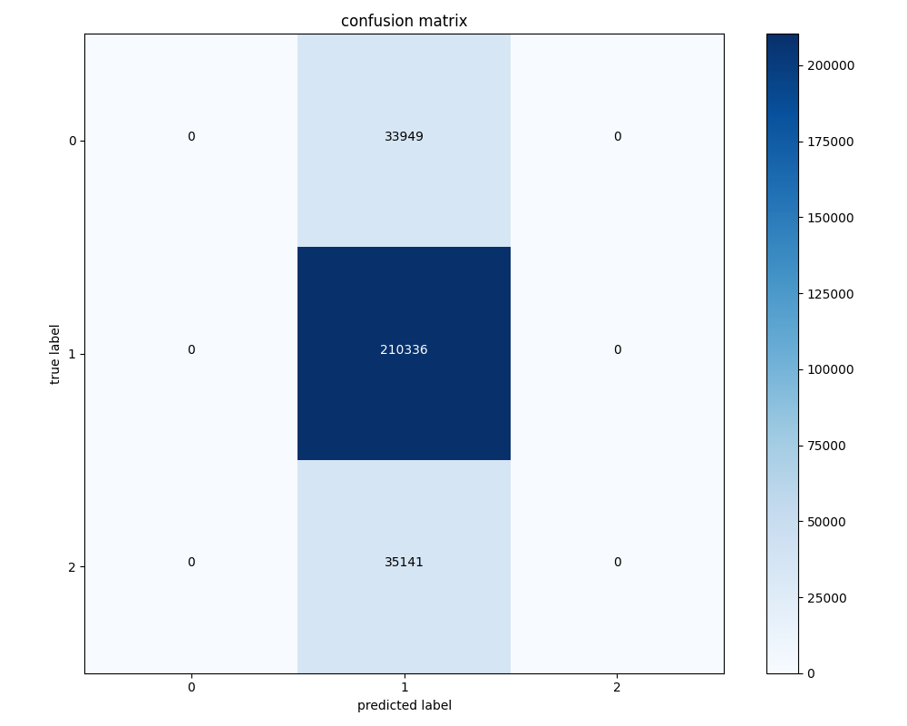
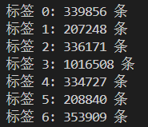
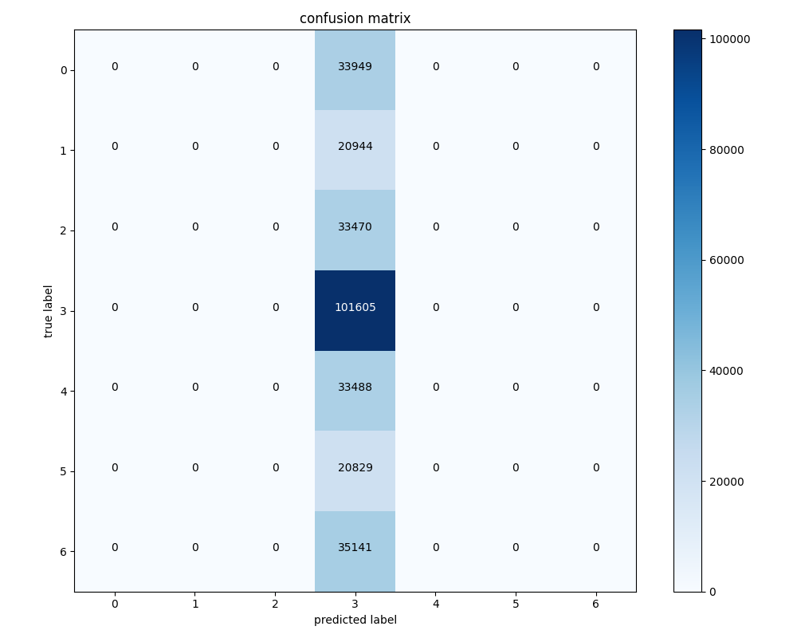
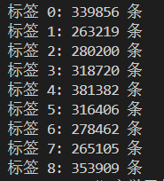
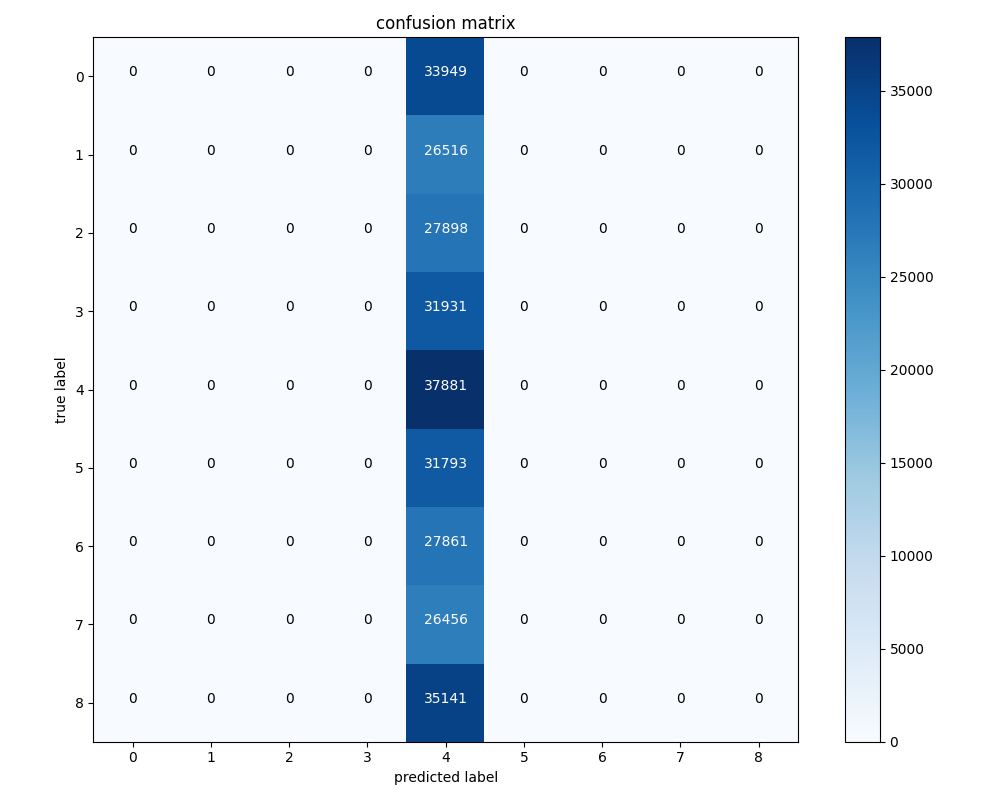
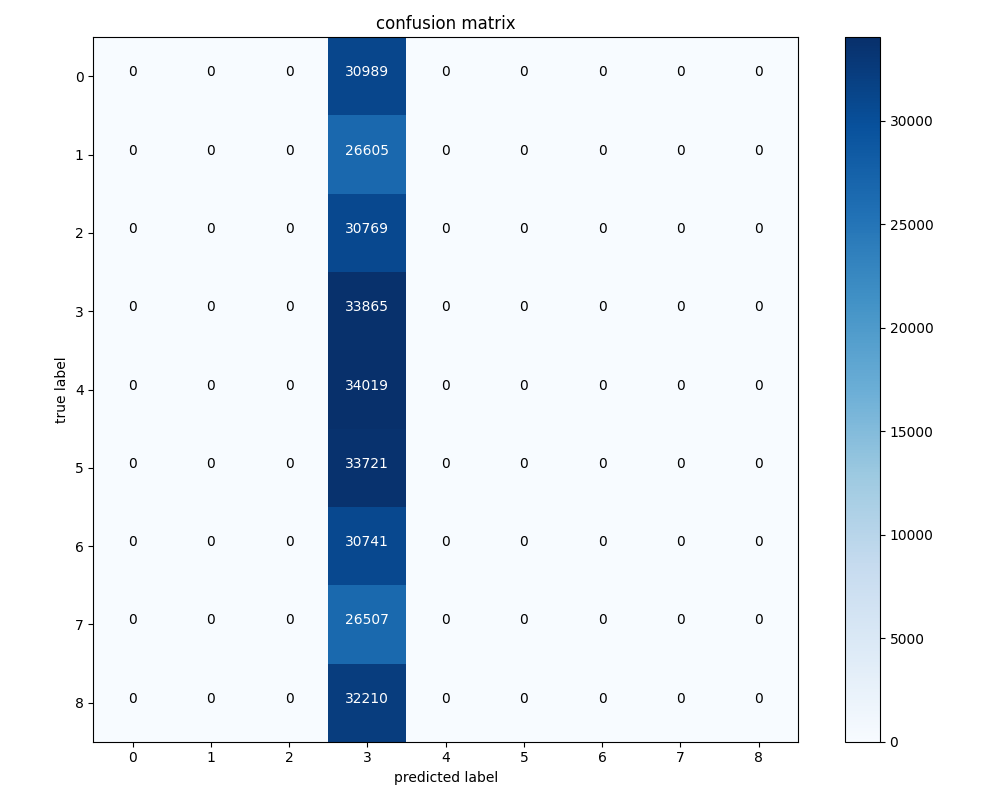
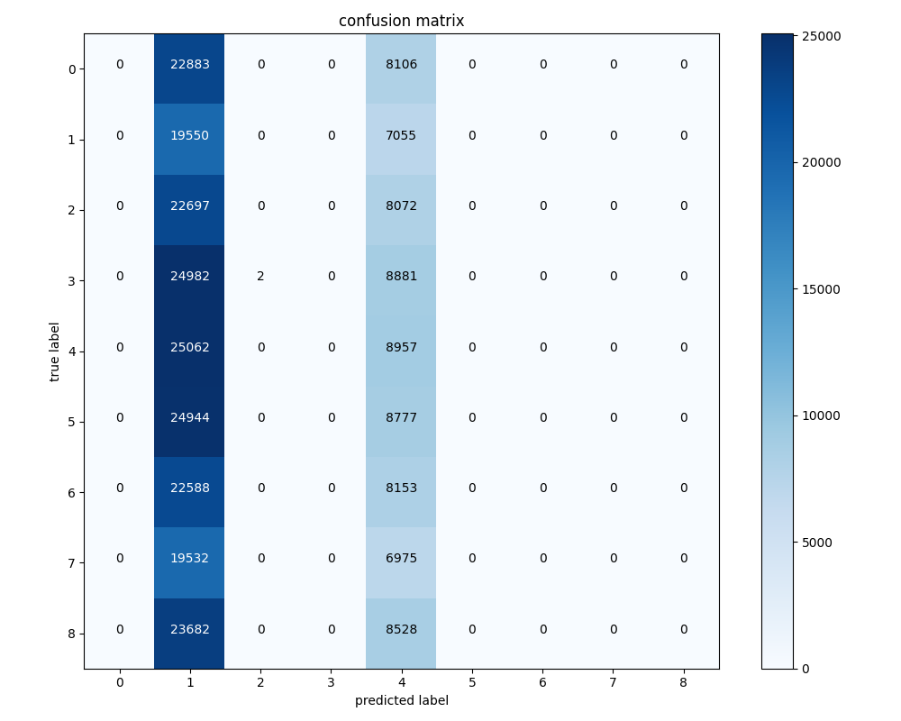

# REPORT

## 关于标签的问题

- 一开始设置的标签是一个三分类问题：如果十分钟后的最低价，减去一分钟之后的最低价，大于千分之一，则为标签2；如果十分钟后的最高价，减去一分钟之后的最低价，小于千分之一，则为标签0；除此之外，都为标签1
- 这样设置标签的目的是：如果为标签2，则开始做多，不考虑交易冲击的情况下，减去交易手续费（开仓平仓两次均为万分之五，合计千分之一），可以保证盈利；如果为标签0，则开始做空，逻辑类似
- 但是这样设置标签有一个很严重的问题，就是标签不平衡。大多数的情况下都是标签1，对应的比例达到了大约百分之七十五，因此模型在训练过1个epoch之后，就全部预测为1，在这样的情况下，预测的准确率仍然能达到75.26%，混淆矩阵如下所示：



- 为了解决这个问题，需要修改标签，最直观的思路是：增加标签种类，让全部猜测为某一个标签的代价提升。
- 修改标签的设计逻辑：

```python
# 计算特征1: (十分钟后的最高价 - 一分钟后最低价) / 当前最低价
df['feature1'] = (df['high'].shift(-10) - df['low'].shift(-1)) / df['low']

# 计算特征2: (十分钟后的最低价 - 一分钟后最高价) / 当前最高价
df['feature2'] = (df['low'].shift(-10) - df['high'].shift(-1)) / df['high']

def create_label(row):
    if row['feature1'] < -0.001:
        return 0
    elif row['feature1'] < -0.0005:
        return 1
    elif row['feature1'] < 0:
        return 2
    elif row['feature2'] > 0.001:
        return 6
    elif row['feature2'] > 0.0005:
        return 5
    elif row['feature2'] > 0:
        return 4
    else:
        return 
```



- 将问题修改为7分类，进行训练，发现此时仍然不平衡非常严重，混淆矩阵如下图所示：



- 只好再次基础上再次细分标签，此时划分标签的逻辑如下所示：

```
# 计算特征1: (十分钟后的最高价 - 一分钟后最低价) / 当前最低价
df['feature1'] = (df['high'].shift(-10) - df['low'].shift(-1)) / df['low']

# 计算特征2: (十分钟后的最低价 - 一分钟后最高价) / 当前最高价
df['feature2'] = (df['low'].shift(-10) - df['high'].shift(-1)) / df['high']

# 计算特征3: (十分钟后的中间价 - 一分钟后中间价) / 当前中间价
df['mid'] = (df['high'] + df['low']) / 2
df['feature3'] = (df['mid'].shift(-10) - df['mid'].shift(-1)) / df['mid']

# 创建标签
def create_label(row):
    if row['feature1'] < -0.001:
        return 0
    elif row['feature1'] < -0.0004:
        return 1
    elif row['feature1'] < 0:
        return 2
    elif row['feature2'] > 0.001:
        return 8
    elif row['feature2'] > 0.0004:
        return 7
    elif row['feature2'] > 0:
        return 6
    elif row['feature3'] > 0.00025:
        return 5
    elif row['feature3'] < -0.00025:
        return 3
    else:
        return 4

```

- 此时对应的不同标签数量为：已经基本平衡为9个标签，仍然出现了只预测一个标签的问题。





- 再修改一下生成标签的逻辑：

```python
def create_label(row):
    if row['feature1'] < -0.0011:
        return 0
    elif row['feature1'] < -0.00045:
        return 1
    elif row['feature1'] < 0:
        return 2
    elif row['feature2'] > 0.0011:
        return 8
    elif row['feature2'] > 0.00045:
        return 7
    elif row['feature2'] > 0:
        return 6
    elif row['feature3'] > 0.00022:
        return 5
    elif row['feature3'] < -0.00022:
        return 3
    else:
        return 4
```

- 分类之后的结果为：

```python
标签 0: 310407 条
标签 1: 263922 条
标签 2: 308946 条
标签 3: 338112 条
标签 4: 342562 条
标签 5: 335834 条
标签 6: 307348 条
标签 7: 266569 条
标签 8: 323559 条
```

- 发现仍然是预测极度不平衡



- 我们需要调整策略了，在训练的时候，应当重采样保证所有的标签数量，完全一样。比如让所有训练集的标签数量条则会归纳为250,000个，如果有不够的自动随即重复补齐。
- 在进行了重采样之后，模型测试集上的不均衡现象得到了一定程度的改善。但是仍然没有本质上解决。



- 猜测出现这种现象，还有一个很重要的原因就是，开始的时候模型参数初始化设置不合理。现在加上比较大的随机初始化，使得可能出现各种标签的预测。

```python
def _initialize_weights(self, scale=0.2):
    for name, param in self.named_parameters():
        if 'weight' in name:
            # 对于权重参数，使用较大的均匀分布初始化
            nn.init.uniform_(param, -scale, scale)
        elif 'bias' in name:
            # 对于偏置参数，初始化为小的常数
            nn.init.constant_(param, 0.05)
```
## 关于损失函数：
- 常规损失函数就是分类器常用的交叉熵
- 首先想到加权交叉熵，可以加权0和2标签，不关注1标签
    - 此时模型基本不输出1
- 继续优化，尝试使用软混淆矩阵，在rmy的gpto3中有对话，“数据划分与模型优化”
